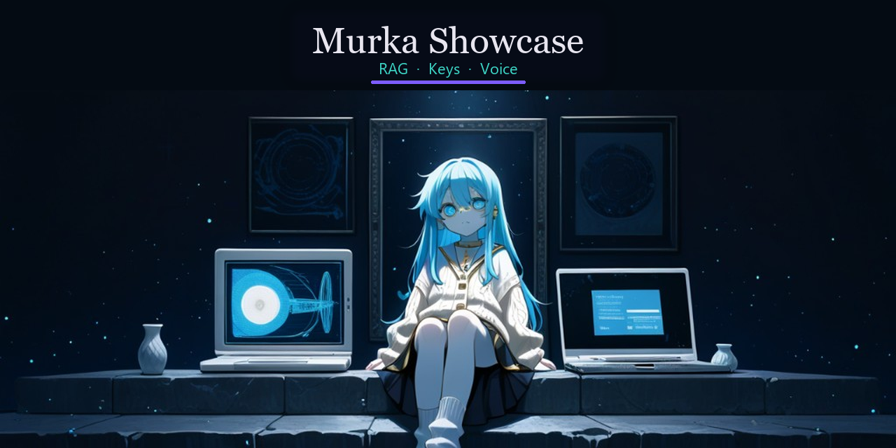
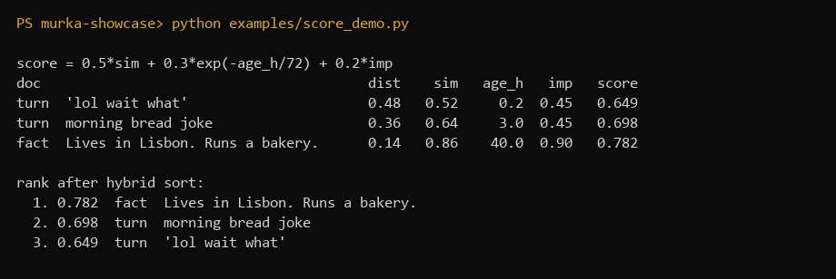
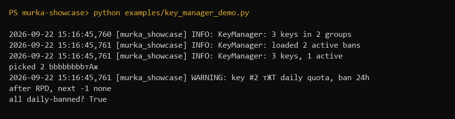
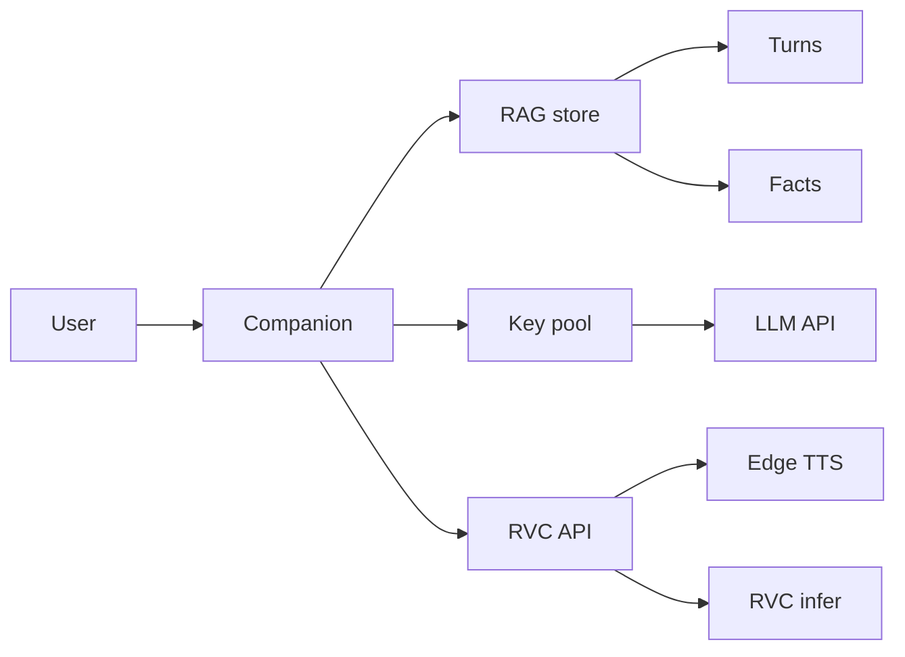
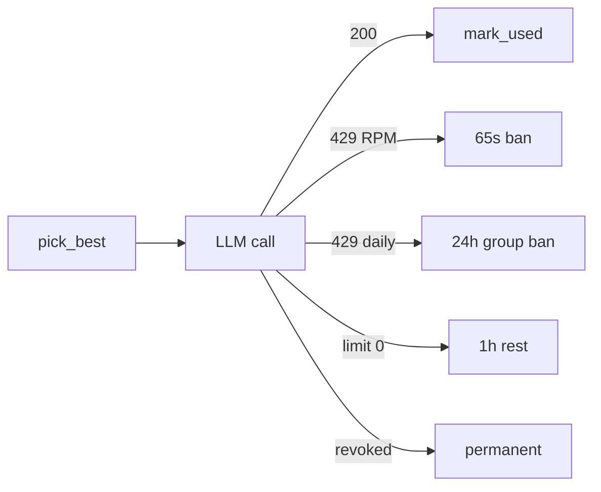

<p align="center">
  
</p>

<p align="center">
  
  
  
  
</p>

# Murka Showcase

Reference modules from a **multimodal AI companion**: long-term memory with a hybrid RAG ranker, LLM key rotation that actually understands rate limits, and an RVC voice service that estimates pitch instead of guessing semitones.

This is **not** a dump of a private production bot. Client tokens, chat plumbing, and unrelated integrations are omitted on purpose. What remains is the engineering that is worth reading.

## Demos (real output, not a mock)

Hybrid ranker — `python examples/score_demo.py` — calls `_score()` in [`rag_memory.py`](rag_memory.py). Off-topic recent chatter loses to an on-topic fact:

<p align="center">
  
</p>

Daily-quota 429 — `python examples/key_manager_demo.py` — group `aaaaaaaa` banned 24h, next key is the other account:

<p align="center">
  
</p>

RVC clip (Edge TTS → character checkpoint). `` is treated as a **picture**, so GitHub showed a broken image. This is an HTML player pointing at a CDN that actually streams the file:

<div align="center">
  <video width="480" height="270" controls preload="metadata" poster="docs/murka-voice-card.png">
    <source src="https://cdn.jsdelivr.net/gh/gidroshlupka-ops/murka-showcase@main/docs/murka-voice.mp4" type="video/mp4">
    <source src="https://github.com/gidroshlupka-ops/murka-showcase/releases/download/rvc-demo/murka-voice.mp4" type="video/mp4">
  </video>
  <br/>
  <audio controls preload="none" src="https://cdn.jsdelivr.net/gh/gidroshlupka-ops/murka-showcase@main/docs/murka-voice.wav"></audio>
</div>
## Why these three pieces

| Module | What it solves | Why it is not a tutorial clone |
| --- | --- | --- |
| [`rag_memory.py`](rag_memory.py) | Users come back days later and expect continuity | Cosine search is over-fetched, then re-ranked by **similarity × recency × importance**. Users are isolated by `uid`. |
| [`key_manager.py`](key_manager.py) | Free-tier LLM APIs die on 429 | Distinguishes RPM vs daily quota, bans a whole **project group**, persists cooldowns in SQLite, soft-caps daily spend. |
| [`voice/app.py`](voice/app.py) | TTS that still sounds like one character | Edge TTS for prosody, RVC for timbre, **pyin median F0 → semitone shift** on voice-to-voice. |

## Architecture



Typical production wiring (outside this repo): a messenger adapter calls `RagMemory.query` before the LLM turn, `KeyManager.pick_best` for the provider call, then `POST /tts` for spoken replies. Image search, persona prompts, and chat IDs stay private.

## Hybrid RAG scoring

ChromaDB returns more neighbors than you need (`k * 4`, capped). Each hit is scored:

```
score = 0.5 * similarity + 0.3 * exp(-age_hours / 72) + 0.2 * importance
```

- **Turns** start at importance `0.45`
- **Session snapshots** (user gone ≥ 2 hours) at `0.75`
- **Facts** at `0.9`

A high-importance, on-topic fact can beat closer-looking small talk. Recency still matters: an 11-day-old fact will lose to a similar recent turn — that is the formula, not a slogan. Embeddings are local (`paraphrase-multilingual-MiniLM-L12-v2`) — no third-party embed API on the hot path.

```python
from rag_memory import RagMemory

rag = RagMemory()
await rag.add_turn(None, uid, user_text, assistant_text)
await rag.add_fact(None, uid, "Lives in Lisbon. Runs a bakery.")
context = await rag.query(None, uid, user_text, k=5)
```

```bash
pip install -r requirements.txt
set PYTHONPATH=.
python examples/score_demo.py
python examples/key_manager_demo.py
```

## Key rotation



- Keys sharing the first 8 characters are one **billing group** (same cloud project).
- Daily soft limit (~900) resets at 08:00 UTC so a traffic spike cannot empty the free quota.
- Ban table is SQLite: a restart does not resurrect a dead key.

```python
from key_manager import KeyManager, load_pool_from_env

km = KeyManager(load_pool_from_env())
idx, key = km.pick_best("chat")
# on 429:
km.ban_429(idx, err_body=response_text, after_retries=False)
```

```bash
python examples/key_manager_demo.py
```

Copy [`.env.example`](.env.example) to `.env`. Never commit real keys.

## Voice (RVC)

Short clip above is Edge TTS → this character’s RVC checkpoint (melody from the TTS pass, timbre from the model). Weights themselves stay out of git — drop your own `weights/model.pth` to run the API.

| Endpoint | Input | Output |
| --- | --- | --- |
| `GET /` | — | health + device |
| `POST /tts` | `{"text": "..."}` | wav (Edge TTS → RVC, default `RVC_PITCH`) |
| `POST /convert` | multipart `file`, optional `pitch` | wav; `pitch=auto` estimates F0 |

Auto pitch: median voiced F0 via librosa `pyin`. Already in the female band (`≥ RVC_F0_FEMALE`, default 175 Hz) → shift `0`. Lower F0 → `12 * log2(target / f0)`, clamped to `[4, 12]`. Denoise on convert does **not** loudness-match, so intonation survives.

```bash
# GPU host with ffmpeg + your weights
pip install -r voice/requirements.txt
uvicorn voice.app:app --host 0.0.0.0 --port 7860
```

Or `docker build -f voice/Dockerfile .`

Response headers on convert: `X-RVC-Pitch`, `X-RVC-Auto`, `X-RVC-F0`.

## Layout

```
.
├── rag_memory.py          # hybrid RAG
├── key_manager.py         # rate-limit rotation
├── logging_setup.py
├── examples/              # runnable demos
├── voice/app.py           # FastAPI RVC service
├── weights/               # your checkpoints only
└── docs/                  # banner, GIFs, voice sample
```

## What is intentionally missing

- Messenger bots, admin commands, allowlists
- API tokens and cookie jars
- Third-party image catalogs
- Character checkpoints and private prompts

If you are hiring: treat this as a **code sample** of systems that already ran in a private companion, not as a product you can `docker compose up` into a full chatbot.

## License

[MIT](LICENSE)
